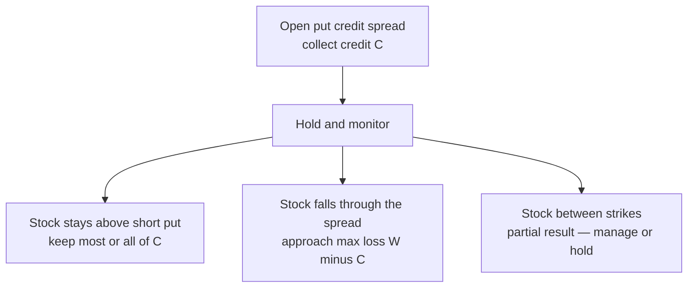

# Credit-spread payoffs

This page answers three practical questions for every credit spread: **How much can I make? How much can I lose? Where is breakeven?**

We will use simple formulas (rendered as math) and a payoff chart so you can see the shape — not a wall of ASCII art.

!!! danger "Not financial advice"
    Fees, early assignment, and broker margin change real outcomes. Numbers below ignore fees.

## Shared vocabulary

| Symbol | Meaning |
|--------|---------|
| \(K_s\) | Strike of the **short** option (the one you sold) |
| \(K_l\) or \(K_h\) | Strike of the **long** option (put lower, call higher) |
| \(W\) | **Width** of the spread = distance between strikes |
| \(C\) | **Net credit** received when you open the trade (per share) |

For one standard equity contract, multiply dollar results by **100**, then by the number of contracts.

!!! tip "The two formulas you will reuse forever"
    For a credit spread (put or call):

    \[
    \text{Max profit} \approx C
    \]

    \[
    \text{Max loss} \approx W - C
    \]

    Both are `[verified]` against standard vertical-spread references.

---

## Put credit spread (PCS) — also called a bull put spread

**Story:** you collect a credit when you believe the stock will **stay above** your short put through expiration (or you exit before a full loss).

**How you build it**

1. Sell a put at strike \(K_s\).  
2. Buy a put at a lower strike \(K_l\).  
3. Same expiration. Width \(W = K_s - K_l\). You receive net credit \(C\).

**Outcomes at expiration (per share, ignore fees)**

| If the stock finishes… | Approximate P&amp;L |
|------------------------|---------------------|
| At or above \(K_s\) | You keep about \(C\) (**max profit**) |
| At or below \(K_l\) | You lose about \(W - C\) (**max loss**) |
| Between the strikes | Something in between |
| Exactly at breakeven | About zero when stock \(= K_s - C\) |

\[
\text{Breakeven} = K_s - C
\]

### Payoff shape at expiration

The chart below is **profit and loss versus stock price at expiration**. Flat top = max profit. Flat bottom = max loss. The rising segment is the zone between strikes.

<figure markdown="span">
  <svg viewBox="0 0 520 260" width="100%" role="img" aria-label="Put credit spread payoff diagram">
    <rect width="520" height="260" fill="transparent"/>
    <line x1="60" y1="20" x2="60" y2="220" stroke="currentColor" stroke-opacity="0.35"/>
    <line x1="60" y1="120" x2="500" y2="120" stroke="currentColor" stroke-opacity="0.35"/>
    <polyline fill="none" stroke="#0d9488" stroke-width="3"
      points="80,200 180,200 300,120 360,50 480,50"/>
    <text x="50" y="54" text-anchor="end" font-size="12" fill="currentColor">+C</text>
    <text x="50" y="124" text-anchor="end" font-size="12" fill="currentColor">0</text>
    <text x="50" y="204" text-anchor="end" font-size="12" fill="currentColor">-(W−C)</text>
    <text x="180" y="240" text-anchor="middle" font-size="12" fill="currentColor">Kl</text>
    <text x="300" y="240" text-anchor="middle" font-size="12" fill="currentColor">BE</text>
    <text x="360" y="240" text-anchor="middle" font-size="12" fill="currentColor">Ks</text>
    <text x="480" y="240" text-anchor="middle" font-size="12" fill="currentColor">price →</text>
    <text x="290" y="18" text-anchor="middle" font-size="13" fill="currentColor">PCS payoff at expiration</text>
  </svg>
  <figcaption>Flat floor = max loss; flat ceiling = max profit; zero line crossed at breakeven \(K_s - C\).</figcaption>
</figure>

**How to read it**

- Far left (stock crushed): you are at the **max loss floor** \(W - C\).  
- Far right (stock strong): you keep the **credit** \(C\).  
- The line crosses zero at **breakeven** \(K_s - C\).

### Tiny numeric example

Suppose you sell the \$100 put and buy the \$95 put for a \$1.20 net credit.

- Width \(W = 5\)  
- Max profit \(\approx \$1.20\) per share (\$120 per contract)  
- Max loss \(\approx \$3.80\) per share (\$380 per contract)  
- Breakeven \(\approx \$98.80\)

---

## Call credit spread (CCS) — also called a bear call spread

**Story:** you collect a credit when you believe the stock will **stay below** your short call (it will not “rip” higher through your strikes).

**How you build it**

1. Sell a call at strike \(K_s\).  
2. Buy a call at a higher strike \(K_h\).  
3. Width \(W = K_h - K_s\). You receive net credit \(C\).

**Outcomes at expiration**

| If the stock finishes… | Approximate P&amp;L |
|------------------------|---------------------|
| At or below \(K_s\) | You keep about \(C\) (**max profit**) |
| At or above \(K_h\) | You lose about \(W - C\) (**max loss**) |
| Between the strikes | Something in between |
| Exactly at breakeven | About zero when stock \(= K_s + C\) |

\[
\text{Breakeven} = K_s + C
\]

### Payoff shape at expiration

<figure markdown="span">
  <svg viewBox="0 0 520 260" width="100%" role="img" aria-label="Call credit spread payoff diagram">
    <rect width="520" height="260" fill="transparent"/>
    <line x1="60" y1="20" x2="60" y2="220" stroke="currentColor" stroke-opacity="0.35"/>
    <line x1="60" y1="120" x2="500" y2="120" stroke="currentColor" stroke-opacity="0.35"/>
    <polyline fill="none" stroke="#0d9488" stroke-width="3"
      points="80,50 200,50 260,120 380,200 480,200"/>
    <text x="50" y="54" text-anchor="end" font-size="12" fill="currentColor">+C</text>
    <text x="50" y="124" text-anchor="end" font-size="12" fill="currentColor">0</text>
    <text x="50" y="204" text-anchor="end" font-size="12" fill="currentColor">-(W−C)</text>
    <text x="200" y="240" text-anchor="middle" font-size="12" fill="currentColor">Ks</text>
    <text x="260" y="240" text-anchor="middle" font-size="12" fill="currentColor">BE</text>
    <text x="380" y="240" text-anchor="middle" font-size="12" fill="currentColor">Kh</text>
    <text x="480" y="240" text-anchor="middle" font-size="12" fill="currentColor">price →</text>
    <text x="290" y="18" text-anchor="middle" font-size="13" fill="currentColor">CCS payoff at expiration</text>
  </svg>
  <figcaption>Flat ceiling = max profit while stock stays below the short call; flat floor = max loss if stock runs through the long call.</figcaption>
</figure>

**How to read it**

- Far left (stock quiet or down): you keep the **credit**.  
- Far right (stock melts up): you hit the **max loss**.  
- Breakeven sits at \(K_s + C\).

---

## Life of a trade (PCS example)

From open to one of three endings — the paths you will journal.

---

## Habits that matter more than memorizing letters

1. **Size from max loss** \(W - C\), not from “the stock costs \$X.” `[verified]` as standard defined-risk sizing.  
2. A **wide** spread can still lose a lot of money — “defined” means *known*, not *small*.  
3. A tiny credit on a wide width is usually a poor reward for the risk you defined.  
4. Prefer a spread over a naked short call: the long leg is what caps the disaster. `[verified]`

## What to do next

Read [Greeks enough to operate](greeks-enough-to-operate.md) for how traders pick strikes with delta, then open the [PCS playbook](../03-strategies/put-credit-spread-playbook.md) when you want the process end-to-end.

## Sources

- [Investopedia — Vertical spread](https://www.investopedia.com/terms/v/verticalspread.asp)  
- [Wikipedia — Credit spread (options)](https://en.wikipedia.org/wiki/Credit_spread_(option))  
- OCC *Characteristics and Risks of Standardized Options*  
- [Sources index](../00-meta/sources.md)  

---

*Not financial advice. Verify broker rules yourself.*
