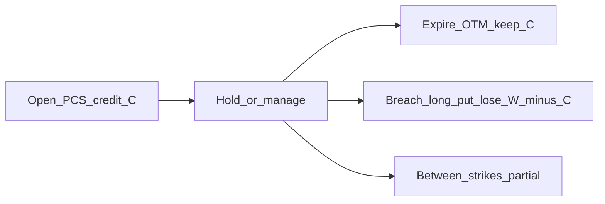

# Credit-spread payoffs

Max profit, max loss, and breakeven for put and call credit spreads — enough to size and journal.

!!! danger "Not financial advice"
    Educational material only. Fees, early assignment, and broker margin change real outcomes.

## Put credit spread (PCS) / bull put spread

**Structure (bullish / “won’t crash through short put”):**

- Sell put at higher strike \(K_s\)  
- Buy put at lower strike \(K_l\)  
- Same expiry; width \(W = K_s - K_l\)  
- Receive net credit \(C\) (per share; ×100 per standard equity contract)

| Outcome | Approx. P&amp;L (per share, ignore fees) | Tag |
|---------|------------------------------------------|-----|
| **Max profit** | \(C\) if underlying ≥ \(K_s\) at expiry | `[verified]` |
| **Max loss** | \(W - C\) if underlying ≤ \(K_l\) at expiry | `[verified]` |
| **Breakeven** | \(K_s - C\) | `[verified]` |

```text
P&L
  +C |======== max profit zone =======>
     |
   0 +-------- BE (Ks - C) ------------
     |
-(W-C)|======== max loss floor ========
      Kl        BE         Ks      price →
```

## Call credit spread (CCS) / bear call spread

**Structure (bearish-to-neutral / “won’t rip through short call”):**

- Sell call at lower strike \(K_s\)  
- Buy call at higher strike \(K_h\)  
- Width \(W = K_h - K_s\)  
- Receive net credit \(C\)

| Outcome | Approx. P&amp;L (per share, ignore fees) | Tag |
|---------|------------------------------------------|-----|
| **Max profit** | \(C\) if underlying ≤ \(K_s\) at expiry | `[verified]` |
| **Max loss** | \(W - C\) if underlying ≥ \(K_h\) at expiry | `[verified]` |
| **Breakeven** | \(K_s + C\) | `[verified]` |

```text
P&L
  +C |======== max profit zone =======>
     |
   0 +-------- BE (Ks + C) ------------
     |
-(W-C)|======== max loss floor ========
      Ks        BE         Kh      price →
```

## Operator rules of thumb

1. **Size off max loss** \(W - C\) (× multiplier × contracts), not notional underlying value. `[verified]` as standard defined-risk sizing approach in retail guidance.  
2. **Credit vs width:** skinny credit relative to width = poor reward for defined risk — journal why you still took it. Any fixed “minimum credit % of width” remains `[operator preference]`.  
3. **Defined ≠ small:** a wide spread can still lose a large dollar amount.  
4. **Why not naked?** A credit spread’s long leg caps payoff risk; an uncovered short call has theoretically unlimited upside risk (`[verified]` via OCC / broker disclosures).

## Mermaid sketch (PCS)



## Sources

- [Investopedia — Vertical spread](https://www.investopedia.com/terms/v/verticalspread.asp) (bull put / bear call P&amp;L)  
- [Wikipedia — Credit spread (options)](https://en.wikipedia.org/wiki/Credit_spread_(option))  
- OCC *Characteristics and Risks of Standardized Options* (writer risk; uncovered writing)  
- [Sources index](../00-meta/sources.md)  

## Next

- [Put credit spread playbook](../03-strategies/put-credit-spread-playbook.md)  
- [Call credit spread playbook](../03-strategies/call-credit-spread-playbook.md)  

---

*Footer: Not financial advice. Verify broker rules yourself.*
