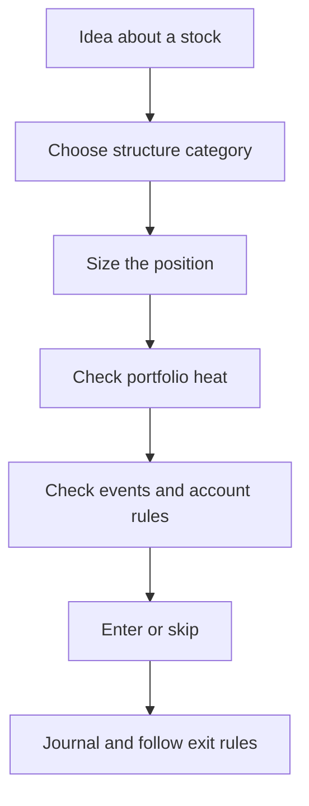

# راه‌های مدیریت ریسک

Options بلوک می‌دهند. **مدیریت ریسک** این است که آن بلوک‌ها را چطور کنار هم بگذارید — یا کدام را اصلاً برندارید — تا یک هفتهٔ بد حساب را تمام نکند.

این صفحه نقشهٔ دسته‌هاست. صفحهٔ بعد همان داستان سهام را از چند راه می‌برد و سود و زیان را به دلار کنار هم می‌گذارد.

!!! danger "توصیه مالی نیست"
    دسته‌ها آموزشی‌اند. هیچ‌کدام «راه درست» برای همه یا هر نوع حساب نیست.

## دستهٔ ۱ — Position sizing

ریسک را با **اندازهٔ** موقعیت کنترل کنید، حتی اگر ساختار ساده باشد.

- مثال: ۵۰ سهم بخرید، نه ۵۰۰.  
- مثال: یک قرارداد options، نه ده تا.  
- در خیلی از راهنماهای خرده‌فروشی می‌گویند روی یک ایده فقط درصد کوچکی از equity را ریسک کنید (اغلب حدود ۱–۲٪). `[verified]` به‌عنوان راهنمایی رایج

Sizing شکل *payoff* را عوض نمی‌کند؛ فقط مقیاسش می‌کند.

## دستهٔ ۲ — ساختار defined یا undefined

| Shape | معنی | مثال‌های کلاسیک |
|-------|---------|------------------|
| **Defined risk** | بدترین حالت از روی ساختار، همان موقع ورود، مشخص است (قبل از کارمزد) | Long options، vertical spreads |
| **Undefined / extreme** | زیان سقف تمیزی ندارد | Naked short call؛ naked short put بزرگ |

Defined یعنی **کوچک** نیست. یک spread عریض هنوز می‌تواند چند هزار دلار زیان بدهد.

## دستهٔ ۳ — Collateral و coverage

دارایی بچسبانید تا short option naked نماند:

| Approach | چه می‌گذارید | اثر |
|----------|-----------------|--------|
| **Covered call** | Long shares | سقف روی صعود سهام؛ ریسک short call با سهام پوشش داده می‌شود |
| **Cash-secured put** | نقد برای assignment | آماده‌اید سهام را در strike بخرید |
| **Protective put** | Long put روی سهامی که دارید | بیمه در برابر سقوط |

این‌ها assignment و نیاز سرمایه را عوض می‌کنند؛ باز هم به sizing و حواس به رویداد نیاز دارید.

## دستهٔ ۴ — Spreads (یک option، دیگری را hedge می‌کند)

یک option دورتر از پول را مقابل short option می‌خرید تا زیان سقف داشته باشد.

| Family | نقد موقع باز شدن | حس معمول ریسک/پاداش |
|--------|--------------|---------------------------|
| **Credit spread** | Net credit می‌گیرید | اغلب **احتمال بالاتر / پاداش محدود**؛ max loss غالباً **بزرگ‌تر** از max profit |
| **Debit spread** | Net debit می‌دهید | اغلب **ریسک محدود / اگر درست باشد پاداش بزرگ‌تر**؛ max profit می‌تواند از debit بیشتر شود |

Credit spread یکی از ابزارهای این دسته است — نه تنها ابزار ریسک، و نه نقطهٔ شروع این دوره.

## دستهٔ ۵ — سقف پرتفوی (heat و تمرکز)

حتی ساختار خوب تک‌معامله، در سقوط با هم می‌شکنند.

- جمع max lossهای defined باز را نسبت به equity سقف بگذارید (**heat**).  
- ریسک روی یک underlying یا یک sector را سقف بگذارید.  
- سقف نرم برای تعداد موقعیت‌هایی که واقعاً می‌توانید در ذهن نگه دارید.

جدول شروع در [پیش‌نویس سیاست ریسک](risk-policy.md) است.

## دستهٔ ۶ — فیلتر رویداد و فرآیند

- اگر از gap می‌ترسید، short premium تازه را به earnings نبرید.  
- Expiration را با تعداد دفعاتی که می‌توانید مرور کنید جور کنید.  
- قوانین manage/exit را قبل از استرس بنویسید.  
- Kill-switch: وقتی فرآیند می‌شکند، ریسک تازه اضافه نکنید.

## این تکه‌ها چطور به هم می‌رسند

ترجیح بعدی Spruce برای اتوماسیون، defined-risk credit spreads است — چون max loss قابل محاسبه است و ریسک صعود naked ممنوع است. این ترجیح **بعد از** فهم همین نقشه و دیدن یک مقایسهٔ منصفانه می‌آید.

## بعد چه بخوانید

[مقایسهٔ استراتژی‌ها با یک مثال](comparing-strategies-example.md) — همان سهام، چند راه، سود و زیان کنار هم.

---

*توصیه مالی نیست. قوانین کارگزار را خودتان چک کنید.*
