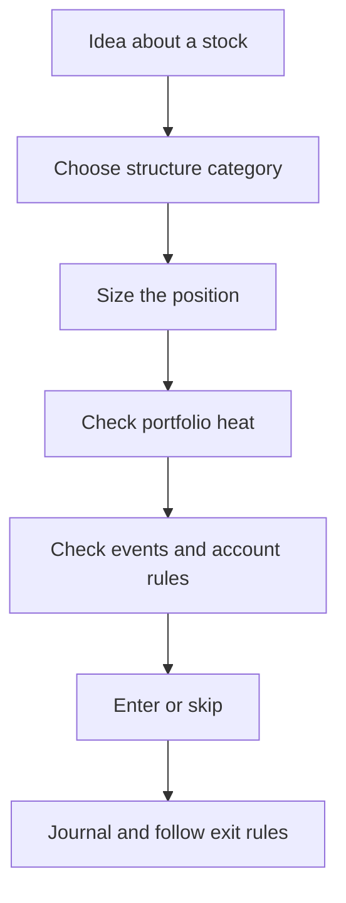

# روش‌های مدیریت ریسک

Options بلوک‌های سازنده می‌دهند. **مدیریت ریسک** این است که آن بلوک‌ها را چگونه ترکیب کنید (یا رد کنید) تا یک هفتهٔ بد حساب را تمام نکند.

این صفحه نقشهٔ دسته‌هاست. صفحهٔ بعدی همان داستان سهام را از چند رویکرد عبور می‌دهد و سود و زیان را به دلار مقایسه می‌کند.

!!! danger "توصیه مالی نیست"
    دسته‌ها آموزشی‌اند. هیچ‌کدام «رویکرد درست» برای هر شخص یا نوع حساب نیست.

## دستهٔ ۱ — Position sizing

ریسک را با **اندازهٔ** موقعیت کنترل کنید، حتی اگر ساختار ساده باشد.

- مثال: ۵۰ سهم بخرید نه ۵۰۰.  
- مثال: یک قرارداد options نه ده تا.  
- قاعدهٔ سرانگشتی در بسیاری از راهنماهای خرده‌فروشی: فقط درصد کوچکی از equity را روی یک ایده ریسک کنید (اغلب حدود ۱–۲٪ بحث می‌شود). `[verified]` به‌عنوان راهنمایی رایج

Sizing شکل *payoff* را عوض نمی‌کند. آن را مقیاس می‌کند.

## دستهٔ ۲ — ساختار defined در برابر undefined

| Shape | معنی | مثال‌های کلاسیک |
|-------|---------|------------------|
| **Defined risk** | بدترین حالت از روی ساختار در ورود مشخص است (قبل از کارمزد) | Long options، vertical spreads |
| **Undefined / extreme** | زیان می‌تواند بدون سقف ساختاری تمیز رشد کند | Naked short call؛ naked short put بزرگ |

Defined به‌معنای **کوچک** نیست. یک spread عریض هنوز می‌تواند هزاران دلار زیان بدهد.

## دستهٔ ۳ — Collateral و coverage

دارایی وصل کنید تا short option حالت naked نداشته باشد:

| Approach | چه وصل می‌کنید | اثر |
|----------|-----------------|--------|
| **Covered call** | Long shares | سقف روی صعود سهام؛ ریسک short call با سهام پوشش داده می‌شود |
| **Cash-secured put** | نقد برای assignment | آمادهٔ خرید سهام در strike هستید |
| **Protective put** | Long put روی سهامی که دارید | بیمه در برابر سقوط |

این‌ها assignment و نیاز سرمایه را عوض می‌کنند؛ همچنان به sizing و آگاهی از رویداد نیاز دارند.

## دستهٔ ۴ — Spreads (یک option دیگری را hedge می‌کند)

یک option دورتر از پول را در برابر یک short option بخرید تا زیان سقف داشته باشد.

| Family | نقد در باز شدن | حس معمول ریسک/پاداش |
|--------|--------------|---------------------------|
| **Credit spread** | Net credit می‌گیرید | اغلب **احتمال بالا / پاداش محدود**؛ max loss غالباً **بزرگ‌تر** از max profit |
| **Debit spread** | Net debit می‌پردازید | اغلب **ریسک محدود / پاداش بزرگ‌تر اگر درست باشد**؛ max profit می‌تواند از debit بیشتر شود |

Credit spreads یک ابزار در این دسته‌اند — نه تنها ابزار ریسک، و نه نقطهٔ شروع دوره.

## دستهٔ ۵ — سقف‌های پرتفوی (heat و تمرکز)

حتی ساختارهای تک‌معاملهٔ خوب در سقوط با هم شکست می‌خورند.

- مجموع max lossهای defined باز را در برابر equity سقف بگذارید (**heat**).  
- ریسک روی یک underlying یا یک sector را سقف بگذارید.  
- سقف نرم برای تعداد موقعیت‌هایی که ذهناً می‌توانید مدیریت کنید.

جدول شروع را در [پیشنهاد سیاست ریسک](risk-policy.md) ببینید.

## دستهٔ ۶ — فیلترهای رویداد و فرآیند

- اگر gap می‌ترساندتان، short premium جدید را به earnings نبرید.  
- Expirationهایی را ترجیح دهید که با تعداد دفعات مرور شما جور باشند.  
- قوانین manage/exit را قبل از استرس بنویسید.  
- Kill-switch: وقتی فرآیند می‌شکند، ریسک جدید اضافه نکنید.

## قطعات چگونه جور می‌شوند

ترجیح **عملیاتی بعدی** Spruce برای اتوماسیون، defined-risk credit spreads است — چون max loss قابل محاسبه است و ریسک صعود naked ممنوع است. آن ترجیح **بعد از** فهم نقشهٔ بالا و دیدن یک مقایسهٔ منصفانه می‌آید.

## گام بعدی

[مقایسهٔ استراتژی‌ها با یک مثال](comparing-strategies-example.md) — همان سهام، چند رویکرد، سود و زیان در کنار هم.

---

*توصیه مالی نیست. قوانین کارگزار را خودتان راستی‌آزمایی کنید.*
