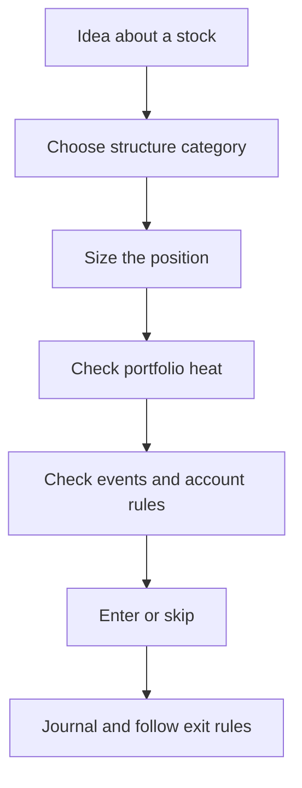

# Ways to manage risk

Options give you building blocks. **Risk management** is how you combine (or refuse) those blocks so a single bad week does not end the account.

This page is a map of categories. The next page runs the same stock story through several approaches and compares wins and losses in dollars.

!!! danger "Not financial advice"
    Categories are educational. None is “the correct” approach for every person or account type.

## Category 1 — Position sizing

Control risk by **how large** the position is, even if the structure is simple.

- Example: buy 50 shares instead of 500.  
- Example: one options contract instead of ten.  
- Rule of thumb in many retail guides: risk only a small percent of equity on one idea (often discussed around 1–2%). `[verified]` as common guidance

Sizing does not change the *shape* of the payoff. It scales it.

## Category 2 — Defined vs undefined structure

| Shape | Meaning | Classic examples |
|-------|---------|------------------|
| **Defined risk** | Worst case known from the structure at entry (before fees) | Long options, vertical spreads |
| **Undefined / extreme** | Loss can grow without a clean structural cap | Naked short call; large naked short put |

Defined does **not** mean small. A wide spread can still lose thousands.

## Category 3 — Collateral and coverage

Attach assets so a short option is not naked:

| Approach | What you attach | Effect |
|----------|-----------------|--------|
| **Covered call** | Long shares | Caps upside on the stock; short call risk is covered by shares |
| **Cash-secured put** | Cash for assignment | You are prepared to buy shares at the strike |
| **Protective put** | Long put on shares you own | Insurance against a crash |

These change assignment and capital needs; they still need sizing and event awareness.

## Category 4 — Spreads (one option hedges another)

Buy a further-out-of-the-money option against a short option so loss is capped.

| Family | Cash at open | Typical risk/reward feel |
|--------|--------------|---------------------------|
| **Credit spread** | You receive a net credit | Often **high probability / limited reward**; max loss frequently **larger** than max profit |
| **Debit spread** | You pay a net debit | Often **limited risk / larger reward if right**; max profit can exceed the debit |

Credit spreads are one tool in this category — not the only risk tool, and not the starting point of the curriculum.

## Category 5 — Portfolio limits (heat and concentration)

Even good single-trade structures fail together in a crash.

- Cap total open defined max losses vs equity (**heat**).  
- Cap risk in one underlying or one sector.  
- Soft-cap how many positions you can mentally manage.

See the [risk policy proposal](risk-policy.md) for a starter table.

## Category 6 — Event and process filters

- Avoid new short premium into earnings if gaps scare you.  
- Prefer expirations that match how often you can review.  
- Write manage/exit rules before you are stressed.  
- Kill-switch: stop adding risk when process breaks.

## How the pieces fit

Spruce’s **later operating preference** for automation is defined-risk credit spreads — because max loss is computable and naked upside risk is banned. That preference comes **after** you understand the map above and see a fair comparison.

## What to do next

[Compare strategies with one example](comparing-strategies-example.md) — same stock, several approaches, wins and losses side by side.

---

*Not financial advice. Verify broker rules yourself.*
